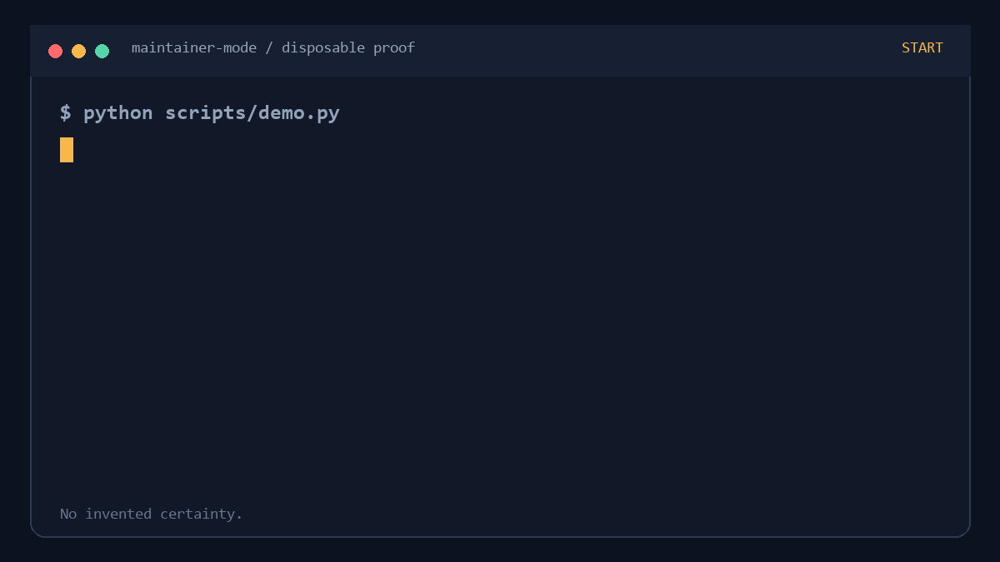

<p align="center">
  
</p>

<h1 align="center">Maintainer Mode</h1>

<p align="center"><strong>The evidence layer for AI-generated pull requests.</strong></p>

<p align="center">Catch stale issues, overlapping work, hidden contribution rules, and test claims from the wrong tree—before they become somebody else's review burden.</p>

<p align="center">
  <a href="https://github.com/jacobbabula/maintainer-mode/actions/workflows/ci.yml"></a>
  <a href="https://github.com/jacobbabula/maintainer-mode/actions/workflows/hol-plugin-scanner.yml"></a>
  <a href="LICENSE"></a>
  <a href="https://github.com/jacobbabula/maintainer-mode/releases/latest"></a>
  <a href="https://github.com/jacobbabula/maintainer-mode/stargazers"></a>
</p>

<p align="center">
  
</p>

Maintainer Mode is a Codex plugin and zero-dependency CLI for evidence-first open-source contribution. Its four skills—triage, execute, prove, and follow up—keep judgment with the agent while deterministic gates handle the facts that should not be guessed.

## Try it in 60 seconds

Requirements: Codex with plugin support, Python 3.10+, and Git.

```bash
codex plugin marketplace add https://github.com/jacobbabula/maintainer-mode.git --ref main --sparse .agents/plugins --sparse plugins
codex plugin install maintainer-mode --source maintainer-mode
```

Start a new Codex task, then try:

```text
Use Maintainer Mode to triage https://github.com/OWNER/REPO/issues/123 before writing code.
```

The first command adds the repository marketplace; the second installs its `maintainer-mode` bundle. To test a local checkout instead:

```bash
git clone https://github.com/jacobbabula/maintainer-mode.git
cd maintainer-mode
codex plugin marketplace add .
codex plugin install maintainer-mode --source maintainer-mode
```

No plugin support yet? The deterministic CLI still works directly:

```bash
python scripts/demo.py
python scripts/maintainer_mode.py doctor ../some-project
```

## The failure it prevents

| Without Maintainer Mode | With Maintainer Mode |
|---|---|
| An agent starts from an old issue tab, misses an overlapping PR, and pastes yesterday's green test result into today's pull request. | A stale snapshot returns `ASK`; duplicate candidates stay explicit; `PROVEN` appears only when the required checks pass on one exact commit and worktree fingerprint. |

That distinction is the product: not more confidence, but confidence with a provenance boundary.

## Four contribution gates

| Stage | Codex skill | Deterministic support |
|---|---|---|
| Decide whether to work | `$triage-contribution` | Live snapshot + `READY` / `ASK` / `STOP` gate |
| Build the smallest correct change | `$execute-contribution` | Repository doctor + authorization boundaries |
| Make only provable claims | `$prove-contribution` | Integrity-checked receipts + exact-tree report |
| Respond without noise | `$follow-up-contribution` | CI/review classification + scoped next action |

## Live GitHub triage

Snapshot is read-only. It captures current issue metadata, assignees, the contributor's open PR count, and PRs whose bodies explicitly mention the issue number.

```bash
python scripts/maintainer_mode.py snapshot --repo owner/project --issue 123 --output issue-123.snapshot.json
python scripts/maintainer_mode.py gate --snapshot issue-123.snapshot.json --policy .maintainer-mode.json
```

Candidate duplicates remain `ASK`, never an automatic accusation: issue-number search is a lead, and a human or agent must inspect the actual diff.

Gate exit codes are automation-friendly: `0` for `READY`, `1` for `ASK`, and `2` for `STOP` or invalid input.

## Exact-tree evidence

```bash
python scripts/maintainer_mode.py run --repo ../some-project --label unit-tests -- python -m unittest
python scripts/maintainer_mode.py run --repo ../some-project --label lint -- ruff check .
python scripts/maintainer_mode.py report --receipts ../some-project/.git/maintainer-mode/receipts --require unit-tests --require lint --output evidence.md
```

Each receipt records the redacted command, exit code, output hashes and byte counts, runtime, Git commit, and a worktree fingerprint that includes tracked changes and untracked file contents. Raw output and environment variables are not persisted.

The report says `PROVEN` only when every required label has a latest passing receipt, every receipt's integrity digest is valid, and all receipts describe the same commit and worktree contents. SHA-256 detects edits; it is not a signature, runner identity, CI result, or maintainer approval.

See [the architecture](docs/architecture.md) and [receipt schema](docs/receipt-schema.md) for the exact contract.

## Explicit repository policy

Maintainer Mode does not pretend it can infer every maintainer rule. Repositories can encode the subset that should be deterministic:

```json
{
  "version": 1,
  "blocked_labels": ["deferred", "duplicate", "wontfix"],
  "accepted_labels": ["accepted"],
  "require_acceptance": true,
  "self_filed_requires_acceptance": true,
  "max_actor_open_prs": 4,
  "snapshot_freshness_hours": 24,
  "required_checks": ["unit-tests", "lint"]
}
```

Unknown rules stay unknown. Missing acceptance labels, stale snapshots, assignments, and candidate duplicates become explicit `ASK` findings. Closed issues and configured blocking labels become `STOP` findings.

## Distribution layout

The repository is both a marketplace source and a registry-discoverable plugin:

```text
.agents/plugins/marketplace.json       # repository marketplace
.codex-plugin/plugin.json              # registry discovery manifest
plugins/maintainer-mode/
  .codex-plugin/plugin.json            # installable bundle manifest
  assets/icon.svg
  skills/
  scripts/maintainer_mode.py
  src/maintainer_mode/
```

The marketplace source is fixed at `./plugins/maintainer-mode`. Distribution tests verify that the entry, manifests, icon, skills, and bundled runner resolve before release.

## Safety contract

- Read-only inspection is allowed when relevant; comments, commits, pushes, PR creation, review submission, and readiness changes require explicit user authorization.
- `READY` means no configured gate blocked the work. It does not mean accepted, assigned, mergeable, or guaranteed to be reviewed.
- Local execution, hosted CI, review approval, merge, and contributor rewards are reported as separate facts.
- Existing worktree changes are preserved. A public contribution never receives invented authorship or verification claims.
- No analytics, credential collection, network service, or hidden prompt telemetry exists.

## Development

```bash
python -m unittest discover -s tests -v
python scripts/demo.py
python scripts/maintainer_mode.py --version
```

The runtime uses only the Python standard library. See [CONTRIBUTING.md](CONTRIBUTING.md) for change requirements.

If Maintainer Mode saves one duplicated PR or one unsupported test claim, consider starring the repository. It helps the next contributor find it.

## License

MIT
